# Modelo Power BI sobre Oro — especificación

> **Estado: la parte TÉCNICA está definida (relaciones, cardinalidades, medidas). El CONTENIDO
> —qué reportes y qué preguntas responde— está pendiente de acordar con Edwin.**
>
> Este documento cubre lo que no depende de esa conversación: cómo se conecta el modelo para que
> los números no se puedan equivocar.

---

## 1. Conexión

**Modo Import** contra el esquema `oro` de la base del tenant (`dw_grupocresta` / `dw_ironnetwork`).
Un archivo `.pbix` por organización: el aislamiento de datos entre clientes se mantiene también
en el consumo.

No conectar a `plata` ni a `bronce`: el consumo es solo sobre Oro (`CLAUDE.md` §14).

> Cuando exista el gateway, Power BI Service se conecta a la base en el servidor propio, no al
> ERP del cliente.

---

## 2. Tablas a importar

### Hechos (4 + 2 de histórico)

| Tabla | Grano | Dominio |
|---|---|---|
| `hecho_venta_linea` | línea de factura/NC de venta | ventas |
| `hecho_compra_linea` | línea de factura/NC de compra | compras |
| `hecho_cartera_cobrar` | partida abierta de CxC | tesorería |
| `hecho_cartera_pagar` | partida abierta de CxP | tesorería |
| `hecho_cartera_cobrar_diaria` | foto diaria (evolución, DSO) | tesorería |
| `hecho_cartera_pagar_diaria` | foto diaria | tesorería |

### Dimensiones (11)

`dim_tiempo` · `dim_cliente` · `dim_proveedor` · `dim_producto` · `dim_vendedor` ·
`dim_organizacion` · `dim_almacen` · `dim_moneda` · `dim_cuenta` · `dim_centro_costo` ·
`dim_tipo_documento`

### Apoyo

`metrica_valor` y `metrica_aging` — **solo para contrastar**. Las medidas DAX deben dar el mismo
número; si no coinciden, hay un error en el modelo. No usarlas como fuente de los visuales.

---

## 3. Relaciones — reglas que NO se negocian

| Regla | Motivo |
|---|---|
| **Todas 1:N**, de la dimensión al hecho | es el sentido natural del filtro |
| **Dirección SIMPLE (unidireccional)**, nunca ambas | el filtro bidireccional crea caminos ambiguos y hace que la misma medida dé números distintos según el visual |
| Clave = `<dim>_clave` ↔ `<dim>_clave` | entero autoincremental, no el código del ERP |
| `dim_tiempo` marcada como **tabla de fechas** (Marcar como tabla de fecha) | sin esto las funciones de inteligencia de tiempo (YTD, mismo período año anterior) fallan en silencio |
| **NO** relacionar `hecho_venta_linea` con `hecho_compra_linea` | son procesos distintos; se comparan por las dimensiones compartidas, no entre sí |
| `dim_cliente` solo a hechos de venta y CxC; `dim_proveedor` solo a compras y CxP | son dimensiones distintas a propósito: hay socios que son ambos (35 en Cresta) |

### Diagrama

```mermaid
erDiagram
    dim_tiempo        ||--o{ hecho_venta_linea       : tiempo_clave
    dim_cliente       ||--o{ hecho_venta_linea       : cliente_clave
    dim_producto      ||--o{ hecho_venta_linea       : producto_clave
    dim_vendedor      ||--o{ hecho_venta_linea       : vendedor_clave
    dim_almacen       ||--o{ hecho_venta_linea       : almacen_clave
    dim_organizacion  ||--o{ hecho_venta_linea       : organizacion_clave
    dim_moneda        ||--o{ hecho_venta_linea       : moneda_clave
    dim_centro_costo  ||--o{ hecho_venta_linea       : centro_costo_clave
    dim_tipo_documento||--o{ hecho_venta_linea       : tipo_documento_clave

    dim_tiempo        ||--o{ hecho_compra_linea      : tiempo_clave
    dim_proveedor     ||--o{ hecho_compra_linea      : proveedor_clave
    dim_producto      ||--o{ hecho_compra_linea      : producto_clave

    dim_tiempo        ||--o{ hecho_cartera_cobrar    : tiempo_clave
    dim_cliente       ||--o{ hecho_cartera_cobrar    : cliente_clave
    dim_cuenta        ||--o{ hecho_cartera_cobrar    : cuenta_clave

    dim_tiempo        ||--o{ hecho_cartera_pagar     : tiempo_clave
    dim_proveedor     ||--o{ hecho_cartera_pagar     : proveedor_clave
```



> `hecho_cartera_*` tiene DOS relaciones con `dim_tiempo` (fecha del documento y fecha de
> vencimiento). La activa debe ser `tiempo_clave`; la de vencimiento queda **inactiva** y se
> invoca con `USERELATIONSHIP` solo en las medidas de aging que la necesiten.

---

## 4. Medidas DAX base

Las definiciones son las del catálogo (`§9`). Nótese que **son `SUM()` simples**: eso es
consecuencia de separar ventas de compras en Oro. Con una tabla de hechos mixta cada medida
necesitaría un `CALCULATE` con filtro de flujo, y arrastrar la columna cruda al lienzo mostraría
ventas+compras sumadas.

```dax
-- ---------------- VENTAS ----------------
Ventas Brutas (sin IVA) :=
    CALCULATE( SUM(hecho_venta_linea[monto_sin_impuesto_local]),
               dim_tipo_documento[tipo_documento] = "factura" )

Devoluciones (sin IVA) :=
    ABS( CALCULATE( SUM(hecho_venta_linea[monto_sin_impuesto_local]),
                    dim_tipo_documento[tipo_documento] = "nota_credito" ) )

-- El signo ya viene normalizado en Plata (NC negativa), así que la neta es la suma directa.
Ventas Netas (sin IVA) := SUM(hecho_venta_linea[monto_sin_impuesto_local])
Ventas Netas (con IVA) := SUM(hecho_venta_linea[monto_con_impuesto_local])

Costo de Ventas := SUM(hecho_venta_linea[costo_local])
Margen Bruto    := SUM(hecho_venta_linea[margen_local])
% Margen        := DIVIDE( [Margen Bruto], [Ventas Netas (sin IVA)] )

-- ---------------- COMPRAS ----------------
Compras Netas (sin IVA) := SUM(hecho_compra_linea[monto_sin_impuesto_local])

-- ---------------- CARTERA ----------------
Saldo CxC := SUM(hecho_cartera_cobrar[saldo_pendiente_local])
Saldo CxP := SUM(hecho_cartera_pagar[saldo_pendiente_absoluto])

CxC Vencida :=
    CALCULATE( [Saldo CxC], hecho_cartera_cobrar[dias_vencido] > 0 )

% CxC Vencida := DIVIDE( [CxC Vencida], [Saldo CxC] )

-- Evolución del saldo: para esto existen las fotos diarias.
Saldo CxC al corte :=
    CALCULATE( SUM(hecho_cartera_cobrar_diaria[saldo_pendiente_local]),
               LASTDATE(hecho_cartera_cobrar_diaria[fecha_corte]) )
```

**Advertencia sobre "Ventas Netas":** en Guatemala el IVA va incluido en el precio, así que
publicar una sola medida llamada "Ventas" es la ambigüedad que este proyecto existe para eliminar.
Las dos versiones van explícitas y **el nombre del visual debe decir cuál usa**.

---

## 4bis. La medida que cambia la lectura del negocio: intercompañía

`dim_cliente` y `dim_proveedor` llevan **`es_intercompania`**, que marca a los socios que son
otras empresas del propio grupo. La lista de NIT llega por `var('nits_grupo')` — la administra el
portal en `gobierno.sociedades`, nunca se fija en el modelo ni en el reporte.

Sin ese atributo, un aging estándar de Proavisa reporta *"el 60% de la cartera vencida a más de 90
días"* y desata una crisis que no existe. Con él:

| | Socios | Saldo | % | Vencido +90 |
|---|---:|---:|---:|---:|
| Grupo (intercompañía) | 5 | 67,155,038 | 72.7% | 50,982,004 |
| **Terceros** | **247** | **25,198,259** | **27.3%** | **4,099,416** |

**Toda medida de cartera y de venta debe poder separar las dos.** Es la diferencia entre 84 días
de venta en la calle y 29.

```dax
Saldo CxC Terceros :=
    CALCULATE( [Saldo CxC], dim_cliente[es_intercompania] = FALSE )

Saldo CxC Grupo :=
    CALCULATE( [Saldo CxC], dim_cliente[es_intercompania] = TRUE )

-- Días de venta en la calle, solo contra venta a terceros: mezclar ambos infla el indicador.
Dias Cartera Terceros :=
    DIVIDE( [Saldo CxC Terceros],
            DIVIDE( CALCULATE( [Ventas Netas (sin IVA)], dim_cliente[es_intercompania] = FALSE ),
                    DISTINCTCOUNT( dim_tiempo[fecha] ) ) )

-- El margen del grupo (30.1%) no es margen de mercado; el de terceros (20.6%) sí.
Margen Terceros % :=
    DIVIDE( CALCULATE( [Margen Bruto],      dim_cliente[es_intercompania] = FALSE ),
            CALCULATE( [Ventas Netas (sin IVA)], dim_cliente[es_intercompania] = FALSE ) )
```

---

## 4ter. Calendario — perspectivas disponibles

`dim_tiempo` (46 columnas, grano DÍA, sin hora) habilita sin escribir DAX adicional:

| Perspectiva | Columnas |
|---|---|
| Natural | `anio` · `trimestre` · `mes_nombre` · `dia` · `anio_mes` |
| ISO (semanas comparables) | `anio_iso` · `semana_iso` · `anio_semana` · `dia_semana_nombre` |
| Fiscal | `anio_fiscal` · `mes_fiscal` (arranque configurable con `var('mes_inicio_fiscal')`) |
| Relativa a hoy | `es_hoy` · `es_mes_actual` · `es_anio_hasta_hoy` · `meses_desde_hoy` |
| Comparativos | `tiempo_clave_anio_anterior` · `tiempo_clave_mes_anterior` |
| Operativa | `es_dia_habil` · `dias_del_mes` · `es_ultimo_dia_mes` |

Las columnas `*_orden` existen para **Ordenar por columna** — sin ellas "Febrero" sale después de
"Diciembre". Los comparativos vienen precalculados para no depender de aritmética de fechas en DAX
con meses de distinta longitud.

---

## 5. Lo que hay que acordar (pendiente de conversación)

1. **¿Qué preguntas debe responder el reporte?** Eso define las páginas, no al revés.
2. **¿Quién lo va a usar?** Gerencia (pocos números grandes) y cobranza (detalle por cliente)
   necesitan páginas distintas.
3. **¿"Ventas" por defecto es con IVA o sin IVA** para cada audiencia? El efectivo de Cresta es
   9.71% contra el 13.64% esperado, así que ≈29% de las ventas son exentas: la diferencia entre
   ambas medidas es material.
4. **¿RLS en Power BI o en la base?** Hoy no hay RLS implementada en ninguna de las dos.
5. **Frecuencia de refresco** y si va a Power BI Service o queda en escritorio.

### Dato que salió del aging y conviene ver antes de diseñar

Cartera por cobrar de Proavisa al corte:

| Rango | Socios | Partidas | Saldo |
|---|---:|---:|---:|
| corriente | 152 | 3,865 | 22,194,774.17 |
| 1-30 | 177 | 1,067 | 8,598,254.72 |
| 31-60 | 23 | 211 | 3,900,411.89 |
| 61-90 | 9 | 190 | 2,578,436.71 |
| **+90** | **25** | **3,006** | **55,081,420.54** |

**El 60% de la cartera está en +90 días y se concentra en 25 socios.** Si eso es real y no un
artefacto de saldos migrados en noviembre 2025, es el hallazgo más vendible del proyecto y
probablemente merece ser la primera página del reporte.
