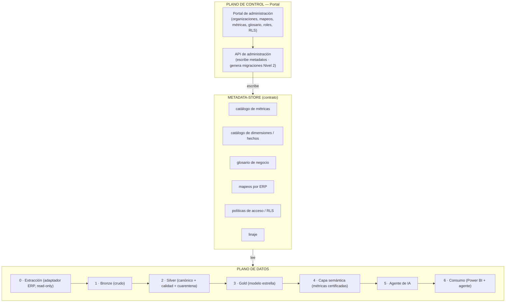
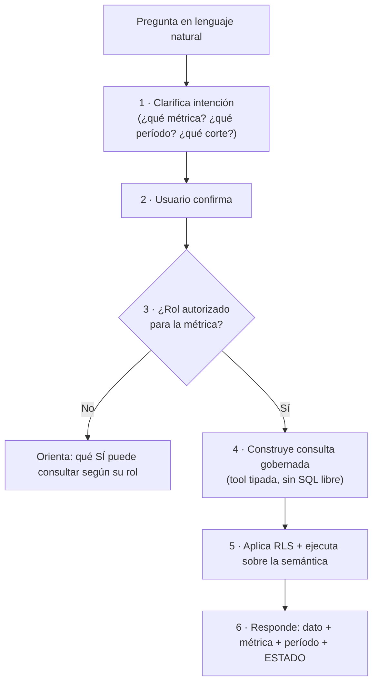

# 02 · Arquitectura Técnica

## 1. Los dos planos



- **Plano de control (portal):** donde se *administran* los metadatos. No mueve datos.
- **Plano de datos:** *lee* los metadatos y actúa (extrae, transforma, responde).
- **Metadata-store:** la frontera. El portal escribe; el plano de datos lee. Desacople limpio.

## 2. Capas del plano de datos

| Capa | Responsabilidad | Contrato de salida | Agnóstica |
|------|-----------------|--------------------|-----------|
| **0 · Extracción** | Único componente que conoce el ERP. Lee catálogos y documentos, solo lectura. | Tablas planas estandarizadas hacia Bronze. | No (una por ERP) |
| **1 · Bronze** | Copia cruda, sin transformar. | Réplica fiel del origen + metadatos de extracción. | Sí |
| **2 · Silver** | Limpia, homologa, **mapea a canónico**, valida (calidad), desvía inválidos a cuarentena. | Datos **canónicos y validados**. | Sí — **costura agnóstica** |
| **3 · Gold** | Modelo dimensional en estrella (hechos + dimensiones). | Tablas listas para consumo. | Sí |
| **4 · Semántica** | Define métricas certificadas una sola vez; 3 ejes de gobierno. | Métricas y dimensiones consultables. | Sí |
| **5 · Agente** | NL → tools tipadas sobre la semántica, con guardas. | Respuesta con dato + métrica + período + estado. | Sí |
| **6 · Consumo** | Dashboards + interfaz del agente. | Presentación. | Sí |

**Silver es la costura agnóstica:** Bronze es distinto por ERP; **de Silver hacia arriba todo
es idéntico**. Ahí ocurre el mapeo ERP→canónico, la homologación y la calidad. No se salta.

### 2.1 Calidad y cuarentena (en Silver, antes de Gold)

Reglas: **completitud** (claves no nulas: fecha, cliente, monto), **validez** (formatos, signo
del monto por tipo de documento, códigos existentes en dimensiones), **consistencia**
(integridad referencial: la nota de crédito referencia una factura existente), **unicidad**
(sin duplicados por clave de documento).

Los registros que fallan **no bloquean** el pipeline: se desvían a `quarantine_<modelo>` con la
regla violada y el timestamp, para revisión.

## 3. Modelo canónico (agnóstico)

El canónico es el **denominador común de todo ERP**. Familias universales de entidades:

- **Partes:** cliente, proveedor, vendedor/empleado.
- **Ítems:** producto o servicio.
- **Documentos:** factura, nota de crédito, pago. Patrón universal **encabezado + líneas**; el evento medible vive en la **línea**.
- **Organización:** empresa (sociedad) → sucursal.
- **Tiempo:** calendario.

### 3.1 Contrato de cada entidad (4 puntos)

1. **Identidad** — clave natural del ERP + clave surrogate propia.
2. **Atributos** — campos universales.
3. **Relaciones** — factura→cliente, línea→producto, nota de crédito→factura.
4. **Convenciones** — signo del monto por tipo de documento, moneda, estados (activo/anulado/borrador).

La "plantilla" es esto: el canónico es fijo; cada ERP trae un **archivo de mapeo** hacia él.

### 3.2 Reglas de modelado

- **Grano del hecho = línea de documento.** Sucursal, centro de costo, producto y cuenta viven a nivel línea.
- **Atributos de encabezado:** empresa (sociedad), cliente, vendedor, fecha, tipo de documento.
- **Atributos de línea:** producto, sucursal, centro de costo, cuenta contable, cantidad, monto.
- **Miembro default en toda dimensión.** No todas las empresas manejan sucursal (o centro de costo). Cuando el origen no lo trae, se asigna el miembro **default/desconocido** para que el hecho siempre cruce.

## 4. Dominios de negocio

Organizados por **quién es dueño del dato**, con nombres claros (sin códigos de ERP). El dueño
produce y certifica el dato; otros lo **consumen** con su permiso (ver [03](03-gobernanza-y-seguridad.md)).

| Dominio | Consume principalmente | En primer corte |
|---------|------------------------|-----------------|
| `datos_maestros` | Todos | ✅ (lo que ventas/tesorería usan) |
| `ventas` | Comercial, contact center | ✅ **núcleo** |
| `tesoreria` | Finanzas, cobranza | ✅ (CxC / aging) |
| `crm` | Contact center, ventas | ⬜ definido |
| `compras` | Abastecimiento | ⬜ definido |
| `inventario` | Bodega, logística | ⬜ definido |
| `produccion` | Fábrica | ⬜ definido |
| `finanzas` | Finanzas | ⬜ definido |
| `gobierno` | Admin / TI | ✅ transversal |

**Regla dueño vs consumidor:** el stock lo produce `inventario`; comercial lo consulta para
decidir despacho. No se reasigna el dominio — se otorga un **permiso de acceso**.

## 5. Modelo dimensional (Gold, esquema estrella)

**Hechos** (grano de línea): `fct_ventas_facturacion`, `fct_cobros_cxc`,
`fct_compras_inventario`, `fct_rentabilidad`.

**Dimensiones compartidas:**

| Dimensión | Niveles / notas |
|-----------|-----------------|
| `dim_tiempo` | día → mes → trimestre → año |
| `dim_cliente` | cliente, grupo, región/cartera |
| `dim_producto` | producto, categoría, unidad de medida |
| `dim_vendedor` | vendedor, equipo |
| `dim_organizacion` | **empresa → sucursal** (con miembro default) |
| `dim_centro_costo` | centro de costo (referenciado a nivel línea; finanzas) |
| `dim_cuenta` | cuenta contable (nivel línea; finanzas) |

> `dim_organizacion` **no** incluye centro de costo ni cuenta contable: esos son dimensiones
> aparte, referenciadas al grano de línea.

## 6. Capa semántica

Corazón del sistema. Define cada métrica **una sola vez** y gobierna **tres ejes** por métrica:

| Eje | Controla | Valores |
|-----|----------|---------|
| **Definición** | La fórmula, única | fórmula + hecho origen + filtros |
| **Certificación** (confianza) | Qué tan confiable es la respuesta | `borrador` → `en_revision` → `certificada` → `deprecada`; más `exploratoria` |
| **Autorización** (acceso) | Quién la puede invocar | por rol / dominio / métrica |

### 6.1 Catálogo de metadatos (el "mapa" del agente)

El agente **nunca lee nombres físicos de tabla**. Razona sobre estas tablas de metadatos; la
capa semántica traduce catálogo → tabla física.

| Tabla | Guarda | Uso del agente |
|-------|--------|----------------|
| `catalogo_metricas` | nombre, definición, fórmula, hecho origen, estado, owner, roles autorizados, sinónimos | Qué puede calcular y para quién |
| `catalogo_dimensiones` | dimensión, atributos, jerarquías, sinónimos | Por qué cortar (cliente, producto, empresa) |
| `catalogo_hechos` | hecho, grano, medidas, dimensiones ligadas | Qué eventos hay y cómo se cruzan |
| `glosario_negocio` | término coloquial → concepto canónico | Traduce el vocabulario del negocio |
| `linaje` | métrica → transformación → fuente | Explica de dónde salió el dato |

### 6.2 Glosario de negocio (vocabulario sin ensuciar el canónico)

El modelo canónico queda **genérico**; el glosario mapea el vocabulario de cada organización:

```
"cartón"          → unidad_medida (30 unidades)
"huevo AA"        → producto, atributo categoría
"granja / planta" → dim_organizacion, nivel sucursal
```

Otra organización cambia solo su glosario; el modelo no se toca.

### 6.3 Métricas certificadas (catálogo inicial)

| Métrica | Definición | Hecho origen |
|---------|------------|--------------|
| Ventas Brutas | Suma de facturas activas del período | `fct_ventas_facturacion` |
| Devoluciones | Suma de notas de crédito por devolución | `fct_ventas_facturacion` |
| Ventas Netas | Ventas Brutas − Devoluciones | `fct_ventas_facturacion` |
| Margen Bruto | Ventas Netas − Costo de Ventas | `fct_rentabilidad` |
| Rentabilidad por Cliente | Margen atribuible al cliente | `fct_rentabilidad` |
| Saldo Pendiente de Cobro | Saldo de documentos abiertos en CxC | `fct_cobros_cxc` |
| Aging / Antigüedad de Saldos | Saldo por rangos: corriente, 1-30, 31-60, 61-90, +90 | `fct_cobros_cxc` |

Atributos obligatorios por métrica: `nombre_oficial`, `definicion_negocio`, `formula`,
`hecho_origen`, `filtros`, `periodicidad`, `owner`, `estado`, `roles_autorizados`,
`aprobadores`, `version_definicion`.

## 7. Agente de IA

### 7.1 Flujo



La **guía proactiva** (pasos 1–3) evita gastar trabajo en lo que el usuario no pidió y, si
preguntó fuera de su alcance, lo orienta a lo que sí puede obtener.

### 7.2 Restricciones duras (guardas, no sugerencias)

1. **Sin SQL libre.** El agente elige una **tool tipada** con parámetros validados `{métrica, dimensiones, filtros, período}`. Nunca concatena ni ejecuta SQL generado por el LLM.
2. **Solo métricas `certificada`.** Las `en_revision`/`deprecada` quedan fuera de respuestas y del prompt de tools. Las `exploratoria` se responden **marcadas y visualmente distintas**, nunca confundibles con certificadas.
3. **RLS siempre.** Toda consulta lleva el contexto de seguridad del usuario. El agente no amplía su alcance.
4. **Ambigüedad → pregunta.** Si no identifica una métrica certificada unívoca, aclara; no asume.

Implementación: las métricas se exponen como **tools tipadas** (una por operación segura sobre
la semántica). El LLM elige tool + parámetros; el **código valida y ejecuta**.

## 8. Mapeo ERP → canónico

Único punto que conoce el ERP. Cada ERP trae su archivo de mapeo. Ejemplo del valor agnóstico:

| Concepto | SAP B1 | Odoo | Canónico |
|----------|--------|------|----------|
| Factura de venta | `OINV` | `account.move` tipo `out_invoice` | `documento` tipo `factura_venta` |
| Nota de crédito | `ORIN` | `account.move` tipo `out_refund` | `documento` tipo `nota_credito` |
| Asiento contable | `OJDT` | `account.move` tipo `entry` | `documento` tipo `asiento` |

SAP usa **una tabla por tipo de documento**; Odoo **unifica en `account.move`** con un campo
tipo. El canónico normaliza ambas formas — **prueba viva de que la arquitectura es agnóstica.**
