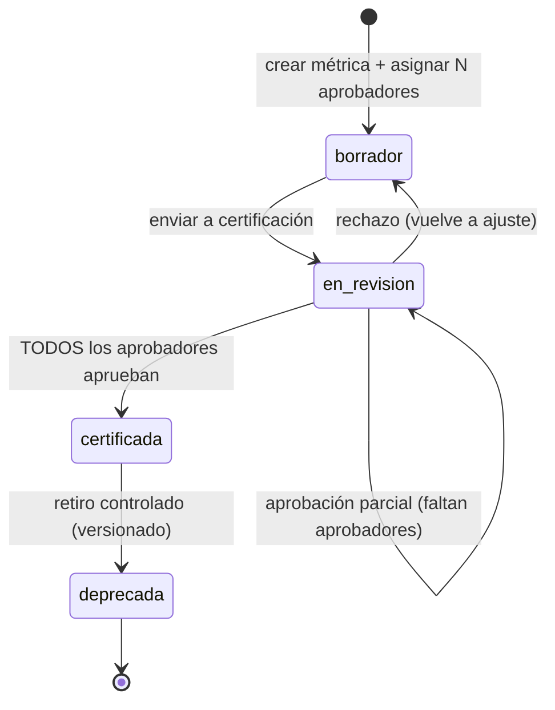
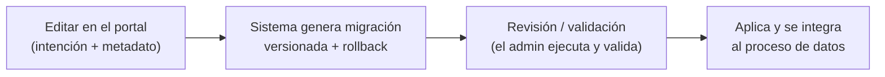

# 03 · Gobernanza y Seguridad

La gobernanza no es una capa: **atraviesa todas**. El portal (plano de control) es su interfaz
— la gobernanza con cara. Certificar, definir calidad, otorgar accesos y registrar linaje son
acciones que ocurren en el portal y quedan auditadas.

## 1. Roles

| Rol | Responsabilidad | Dónde actúa |
|-----|-----------------|-------------|
| **Data Owner** | Certifica las definiciones de métricas de su dominio | Aprueba en el portal |
| **Data Steward** | Reglas de calidad + catálogo + glosario | Portal |
| **Data Engineer** | Pipelines, capas, mapeos por ERP | Repo + portal (mapeos) |
| **BI Architect** | Capa semántica + configuración del agente | Repo + portal |
| **Admin del portal** | Organizaciones, usuarios, RLS, secretos | Portal |

## 2. Certificación de métricas (multi-aprobador)

Una métrica es **consenso de negocio**: no entra en funcionamiento hasta que **todos** sus
aprobadores la aprueban.



- Mientras no esté `certificada`, el agente **no la usa**.
- Cada aprobación queda auditada (quién, cuándo).
- Cambiar una fórmula ya certificada **no se edita en silencio**: se crea una **nueva versión**
  (`version_definicion`) y se recertifica.
- Métricas `exploratoria`: más abiertas, responden con **etiqueta y diseño distinto** en el
  front; nunca se presentan como certificadas.

## 3. Modelo de acceso

Dos controles **independientes**. No confundirlos:

| Control | Pregunta que responde | Mecanismo |
|---------|-----------------------|-----------|
| **Autorización** | ¿Qué métricas/dominios puede invocar? | Grants por rol / dominio / métrica |
| **RLS** (Row-Level Security) | Dentro de lo autorizado, ¿qué filas ve? | Scoping por empresa / sucursal / región / cartera |

### 3.1 Autorización — grants por capas (práctico)

La asignación debe ser flexible: se otorga acceso al nivel que convenga.

```
rol "comercial"        → dominios: {ventas}          + métricas: {Ventas Netas, Devoluciones}
rol "finanzas"         → dominios: {tesoreria, finanzas}
rol "contact_center"   → métricas: {Pedidos abiertos, Estado de entrega}   (NO rentabilidad)
```

Un usuario hereda los grants de su(s) rol(es). Se definen los roles una vez y se asignan
usuarios con su alcance.

### 3.2 RLS — scoping por ejes

```
usuario "Juan (finanzas)"
  → empresas visibles: {1, 3, 5}     ← ciertos usuarios solo ven ciertas sociedades
  → sucursales: todas dentro de esas
  → región / cartera: según su rol
```

El agente aplica **empresa + sucursal + región + cartera** en cada consulta. Un usuario de la
empresa 1 nunca ve datos de la empresa 3, aunque compartan el mismo `fct_ventas`.

### 3.3 Ejemplo integrado (contact center)

```
"¿rentabilidad del cliente X?"
 → métrica Rentabilidad: rol contact_center NO autorizado
 → responde: "No tienes acceso a esa métrica; sí te puedo dar estado de pedidos y entregas."

"¿pedidos abiertos del cliente X?"
 → métrica Pedidos: autorizado + RLS (solo su cartera)
 → responde con dato + período
```

## 4. Tenencia (dos niveles)

| Nivel | Qué es | Aislamiento |
|-------|--------|-------------|
| **Tenant / Organización** | Cliente o grupo (holding) | **Fuerte** — base y portal propios por tenant (instancia dedicada) |
| **Empresa / Sociedad** | Entidad legal dentro del tenant (p. ej. 10 empresas) | **Blando** — misma tabla, `empresa_id` + RLS |
| Sucursal | Debajo de empresa (nivel línea, con default) | RLS |

- **Una sola** `fct_ventas` por tenant; las empresas se distinguen por `empresa_id`. No hay una tabla de ventas por empresa.
- Entre tenants el aislamiento es total: base y portal por organización. El despliegue se hace por instancia (un portal por organización).

## 5. Plano de control (portal)

Producto de primera clase (no desechable), **completo por diseño**, construido por etapas.

### 5.1 Funciones

- Registrar organizaciones (tenant) y sus empresas.
- Configurar la conexión read-only al ERP (SAP B1 / Odoo).
- Administrar mapeos ERP→canónico, glosario y catálogo de métricas.
- Gestionar el flujo de certificación (aprobadores).
- Administrar roles, grants y políticas RLS.
- Auditar todo cambio y versionar los metadatos.

### 5.2 Evolución de schema — **Nivel 2** (obligatorio)

Cuando se requiere una tabla o columna nueva (p. ej. "agregar una columna al cliente"):



- **Prohibido Nivel 3** (auto-DDL en caliente sin revisión): viola la trazabilidad y la regla
  "nada en silencio, siempre rollback".
- El portal **no concatena SQL**: escribe metadatos estructurados; un motor controlado los
  convierte en migraciones parametrizadas y revisadas (mismo principio anti-inyección que se le
  exige al agente).

### 5.3 El portal es el objetivo de mayor valor

El plano de control gobierna a la gobernanza: quien edita un mapeo o una política RLS puede
afectar datos de toda una organización. Por eso el portal exige:

- Autorización fuerte + **auditoría de todo cambio** (quién cambió qué, cuándo).
- **Versionado** de metadatos.
- Cambios sensibles (certificación de métrica) pasan por aprobación; los cambios de RLS son
  responsabilidad del admin **con auditoría** (sin aprobación múltiple, para no volverlos inoperables).

## 6. Secretos y trazabilidad

- **Secretos por organización:** las credenciales de conexión read-only al ERP van a un
  secrets manager **por tenant**, nunca al `metadata-store` ni al código.
- **Linaje:** cada tabla lleva `source_origen`, `extraido_en`, `proceso_transformacion`,
  `version_proceso`. Cada métrica: `version_definicion`, `fecha_certificacion`,
  `certificada_por`. Objetivo: ante cualquier respuesta del agente, reconstruir qué fuente, qué
  transformación y qué versión de métrica la sustentó.

## 7. Prohibido (resumen de seguridad)

- Generar y ejecutar SQL arbitrario del LLM contra la base.
- Que el agente acceda a hechos crudos, staging o fuentes fuera de la capa semántica.
- Escribir en el ERP de origen o consultar sus tablas base fuera de la vía read-only aprobada.
- Recalcular una métrica fuera del catálogo.
- Devolver una respuesta sin la métrica y el período que la sustentan.
- Saltar o ampliar el RLS del usuario.
- Evolución de schema en Nivel 3 (auto-DDL sin revisión ni rollback).
